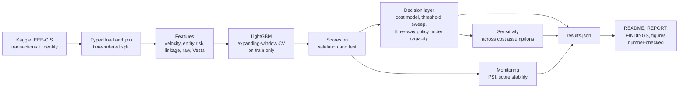

# Card Fraud Decision Engine


**A fraud score is not a decision.** This project builds a LightGBM fraud model on
the IEEE-CIS card-not-present dataset and then does the part that usually gets
skipped: it turns the score into an **approve / review / decline policy** chosen to
maximise expected profit under a fixed manual-review capacity, and tests, on a
held-out later time period, whether the **profit-optimal cutoff beats the
AUC-optimal (Youden-J) cutoff**. Results are reported in money and customer
impact (good-customer disruption rate, fraud captured in dollars and counts,
review queue volume), not only in AUC.

> **Status.** The code, tests and reporting pipeline are complete. The results
> tables and figures are generated by `python -m src.run_all` from the Kaggle
> data, which is not redistributed here. On a full run this README is
> regenerated from `outputs/results.json` with the headline results table, the
> profit curve and the AUC-optimal versus profit-optimal comparison.

## What makes it more than a model

| Component | What it does |
|---|---|
| **Pre-registration** | Split rule, primary metrics, baselines, cost-parameter ranges and success criteria written and committed *before* any modelling code ([PRE_REGISTRATION.md](PRE_REGISTRATION.md)). |
| **Leakage-safe features** | Velocity (counts and amounts per card over the prior hour / day / week, strictly backward-looking), entity risk (out-of-fold smoothed target encoding of merchant proxies), and linkage (distinct cards per device, emails and addresses per card: signals of organised fraud). |
| **Honest evaluation** | Time-ordered split (train, then validation, then test). Tuning with expanding-window CV inside train only. Thresholds chosen on validation, applied once to test. Paired bootstrap intervals; an interval that includes zero is reported as such. |
| **Decision layer** (`src/decision/`) | Cost model (fraud loss, false-decline margin and churn, review cost, imperfect analyst catch rate), exhaustive threshold sweep, Youden-J vs profit-optimal comparison, two-threshold approve / review / decline policy under a review-capacity constraint, swap-set analysis. |
| **Sensitivity** | Cost parameters are assumptions, so the policy is re-optimised over a pre-registered grid and the claim is limited to the *ranking* of policies, not absolute dollars. |
| **Governance** | PSI drift per feature with standard 0.10 / 0.25 bands, score stability over time, a monitoring plan with owners and triggers, severity-rated findings. |
| **Number provenance** | README, report and findings are rendered from `results.json`; a check fails the build if any number in them is not in that file. |

## How the work is verified

| Check | What it proves | Where |
|---|---|---|
| Time-split test | `max(train.TransactionDT) < min(validation) < min(test)`; tied timestamps never straddle a boundary | `tests/test_split.py` |
| Velocity leakage guards | On a hand-built fixture, a transaction never sees itself, same-second peers, other cards or the future; appending future rows changes nothing | `tests/test_velocity.py` |
| Target-encoding guards | Unseen categories get the prior (not NaN, not a leaked value); a row never sees its own label; test labels are never read | `tests/test_target_encoding.py` |
| Linkage guards | Distinct-entity counts are hand-verified and unaffected by later rows | `tests/test_linkage.py` |
| Pipeline label isolation | Flipping every validation and test label changes no feature value | `tests/test_pipeline.py` |
| Cost-function unit tests | Money checked against hand-computed values for approve, decline, review and capacity-limited policies | `tests/test_costs.py` |
| Threshold logic | Youden-J matches brute force; profit optimum never loses to Youden in-sample; tied scores stay on one side | `tests/test_threshold.py` |
| Determinism | Features, model predictions and selected thresholds are bit-identical across runs under the fixed seed | `tests/test_pipeline.py` |
| Model archive | JSON archive (LightGBM native model string, no pickle) reloads to bit-identical predictions | `tests/test_pipeline.py` |
| Number provenance | Fabricated numbers are caught; identifiers and code are ignored | `tests/test_documents.py` |

Test run on the committed code:

```text
$ python -m pytest -q
............s..................................................          [100%]
62 passed, 1 skipped in 14.33s
```

The skipped test checks the generated documents against `outputs/results.json`
and activates once the full pipeline has produced them.

The whole pipeline can also be exercised end to end without Kaggle access on a
small synthetic dataset with the same schema (`make smoke`). That run is a
plumbing check only; its numbers are not results and are written outside
`outputs/`.

## Architecture



## Cost model

| Outcome | Cost |
|---|---|
| Fraud approved | full transaction amount |
| Legitimate customer declined | `margin_rate x amount + churn_penalty` |
| Sent to manual review | `review_cost`, plus the amount if the analyst misses the fraud (probability `1 - review_catch_rate`) |

Defaults and pre-registered ranges are in `config/costs.yaml` and
[PRE_REGISTRATION.md](PRE_REGISTRATION.md). They are assumptions, which is why the
sensitivity analysis exists.

## Limitations

- **Cost parameters are assumptions**, not measured from any portfolio; only the
  ranking of policies across the pre-registered range is claimed.
- **Labels are chargebacks, not confirmed fraud**, and the data provider
  propagates a fraud label to later transactions on the same account.
- **No true timestamp.** `TransactionDT` is a seconds offset from an undisclosed
  reference, used only for ordering and relative durations.
- **One test period, one data source.** Bootstrap intervals cover row sampling,
  not period-to-period variation.

The full, severity-rated list is generated into `FINDINGS.md` on a full run.

## Reproduce

Requires Python 3.12, a Kaggle account, and acceptance of the competition rules
at <https://www.kaggle.com/c/ieee-fraud-detection/rules>. Place the API token at
`~/.kaggle/kaggle.json`.

```bash
make setup     # virtualenv + pinned requirements
make all       # download, features, train, decide, monitor, report, tests
make smoke     # full pipeline on synthetic data, no Kaggle needed
```

Without `make`:

```bash
python -m venv .venv && .venv/bin/pip install -r requirements.txt   # Windows: .venv\Scripts\...
python -m src.run_all          # all stages
python -m pytest -q
```

The seed is fixed in `config/pipeline.yaml`; LightGBM runs with
`deterministic=true` and a fixed thread count. Raw and derived data are
gitignored and rebuilt by the pipeline.

## Layout

| Path | Contents |
|---|---|
| `PRE_REGISTRATION.md` | Split rule, metrics, baselines, cost ranges, success rule; frozen before modelling |
| `DECISIONS.md` | Design choices and the reasoning behind each |
| `config/` | Pipeline and cost parameters |
| `src/data`, `src/features`, `src/models` | Data, feature families, model and baselines |
| `src/decision` | Cost model, threshold sweeps, three-way policy, swap sets, sensitivity |
| `src/monitoring` | PSI and score stability |
| `src/reporting` | Figures, document rendering, number check |
| `docs_templates/` | Templates for README, REPORT, FINDINGS, MONITORING_PLAN |
| `tests/` | Leakage guards, split, cost functions, determinism, number check |

Licence: MIT.
