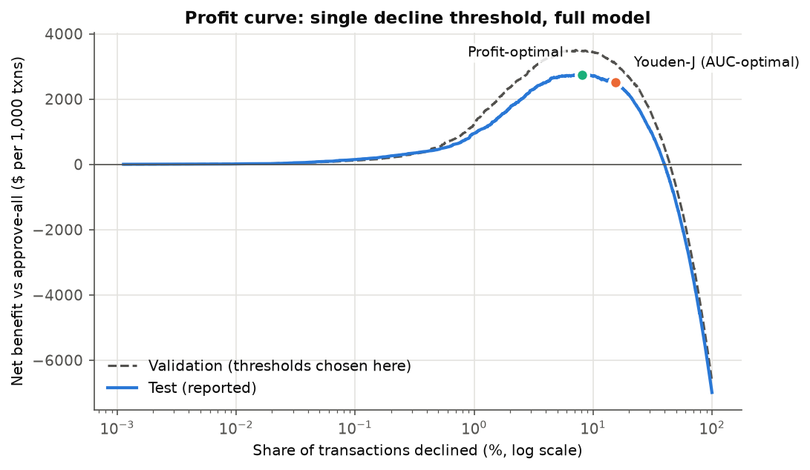
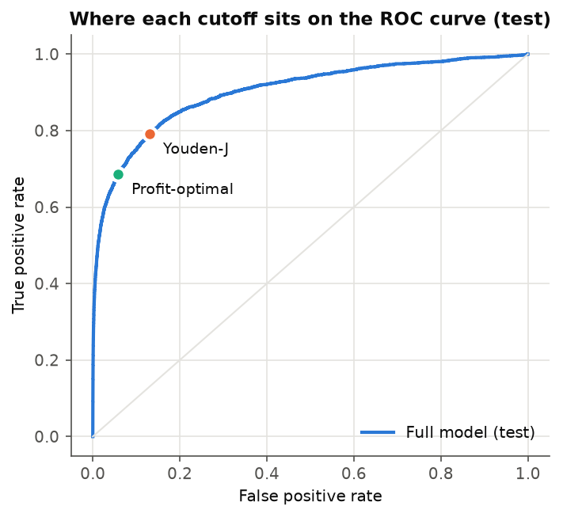
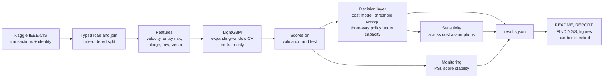

# Card Fraud Decision Engine


**A fraud score is not a decision.** This project builds a LightGBM fraud model on
the IEEE-CIS card-not-present dataset and then does the part that usually gets
skipped: it turns the score into an **approve / review / decline policy** chosen to
maximise expected profit under a fixed manual-review capacity, and shows, on a
held-out time period, that the **profit-optimal cutoff is not the AUC-optimal
cutoff**. Every result is reported in money and customer impact, not only in AUC.

### At a glance

- **Net benefit of the selected policy:** $2,811.82 saved per
  1,000 test transactions versus approving everything, while
  declining 4.88% of legitimate customers and
  capturing 66.6% of fraud dollars.
- **AUC-optimal vs profit-optimal:** the Youden-J cutoff leaves
  $213.54 per 1,000
  transactions on the table  (interval excludes zero).
- **Against a hand-written rules baseline:** $2,559 (95% CI $2,264 to $2,833)
  more per 1,000 transactions.
- **Robustness to the cost assumptions:** beats the rules baseline in 100.0%
  of 750 cost scenarios; profit cutoff beats Youden-J in 80.0%;
  full pre-registered ordering in 60.7% (H4 **FAIL**).
- **Model:** test PR-AUC 0.552, ROC-AUC 0.903,
  on a strictly later time period than training.
- **Verified:** 63 automated tests passing
  (0 failing), including leakage guards and a determinism check;
  every number in this README is machine-checked against `outputs/results.json`.

The dollar figures depend on cost parameters that are **assumptions**, not
measurements, so no absolute dollar amount here is a forecast of real savings.
Even the **ranking** of policies is only partly robust to those assumptions: the
model-driven policy beats the rules baseline in 100.0% of the
pre-registered sensitivity grid, but the full pre-registered ordering holds in
60.7% of it, short of the 80% target (H4 failed).
See [Limitations](#limitations) directly below.

## Limitations

Read these before the results. Full list with severity ratings: [FINDINGS.md](FINDINGS.md).

- **Cost parameters are invented.** Margin rate, churn penalty, review cost and
  analyst catch rate are defaults chosen in [PRE_REGISTRATION.md](PRE_REGISTRATION.md),
  not estimated from any portfolio. Absolute dollar results move by a large factor
  across the pre-registered grid (below); only the policy ranking is claimed.
- **Labels are chargebacks, not confirmed fraud.** `isFraud` marks reported
  chargebacks and propagates the label to later transactions on the same account.
  Some "fraud" is friendly fraud or disputes; some fraud is never charged back.
- **No true timestamp.** `TransactionDT` is a seconds offset from an undisclosed
  reference. It is used only to order rows and measure relative durations. Days
  and "per day" figures are in relative time.
- **Drift between training and test.** 17 of
  148 model features exceed a PSI of 0.25
  between the training and test periods (6 more between
  0.10 and 0.25). Results are for one
  period of one merchant population.
- **Review queue over capacity on test.** The three-way policy was sized to
  34.5 reviews per day on validation; on test it averaged
  38.2 and exceeded capacity on
  20 of 31 relative days. Overflow handling is not modelled.
- **One test period, one data source.** The test split covers
  30.8 relative days and 88,581 transactions.
  Intervals below are bootstrap intervals over transactions within that period;
  they do not cover period-to-period variation.

## Data

IEEE-CIS Fraud Detection (Vesta): 590,540 labelled card-not-present
transactions, 3.50% fraud, spanning 182.0 days of relative time;
24.4% carry device and identity information. Files were
verified against the official competition file sizes and row count before use
(provenance in [FINDINGS.md](FINDINGS.md); full profile in
[DATA_DICTIONARY.md](DATA_DICTIONARY.md)).

The split is strictly by time, never random:

| Split | Transactions | Fraud rate | Relative days | Used for |
|---|---:|---:|---:|---|
| Train | 413,378 | 3.52% | 119.8 | features, tuning, model fit |
| Validation | 88,581 | 3.43% | 31.4 | choosing every threshold |
| Test | 88,581 | 3.48% | 30.8 | reporting only |

## Features

148 features in five families, every fitted step using training rows only:

| Family | Count | What it captures |
|---|---:|---|
| Velocity | 20 | Per card and per account: transaction counts and amount sums over the prior hour, day and week; time since last transaction; tenure. Strictly backward-looking. |
| Entity risk | 4 | Out-of-fold, smoothed historical fraud rate of product code, billing region and email domains. |
| Linkage | 7 | Distinct cards per device, OS, browser and device fingerprint; distinct emails and addresses per card. Signals of organised fraud. |
| Raw | 82 | Amount, card attributes, counts, time deltas, match flags, identity fields (native categorical handling, no one-hot). |
| Vesta | 35 | Pruned from the provider's engineered V-columns by NaN-group correlation filtering. |


## Headline results

Population: the final 15% of labelled
transactions in time order (the test split; 88,581 transactions,
3.48% labelled fraud, $469,609
of fraud by amount). All thresholds were chosen on the validation split, never on
test. Net benefit is cost saved relative to approving everything. Default cost
parameters: margin rate 0.02, churn penalty
$10, review cost $5,
review catch rate 0.85, review capacity
34.5 cases per day
(1% of mean daily training volume).

| Policy | Net benefit per 1,000 txns | Net benefit, test period | Good-customer disruption rate | Fraud captured (count) | Fraud captured ($) | Reviews per day | Declined |
|---|---:|---:|---:|---:|---:|---:|---:|
| Approve everything | $0 | $0 | 0.00% | 0.0% | 0.0% | 0.0 | 0.00% |
| Rules baseline (amount above training P90 and new card) | $253 | $22,421 | 3.64% | 5.3% | 21.0% | 0.0 | 3.69% |
| Full model, Youden-J cutoff (AUC-optimal) | $2,521 | $223,340 | 13.11% | 79.1% | 80.2% | 0.0 | 15.41% |
| Full model, profit-optimal cutoff | $2,735 | $242,256 | 5.87% | 68.6% | 66.4% | 0.0 | 8.05% |
| No-velocity model, three-way policy | $2,797 | $247,792 | 6.92% | 72.2% | 71.1% | 39.2 | 9.13% |
| **Full model, three-way policy (capacity-constrained)** | **$2,812** | **$249,073** | **4.88%** | **68.8%** | **66.6%** | **38.2** | **7.02%** |

Fraud captured counts a reviewed fraud case as caught with probability equal to
the catch rate. The three-way policy also sends
1.26% of legitimate customers
to review, which delays but does not decline them.

Paired bootstrap comparisons on test (1,000 resamples, net
benefit in $ per 1,000 transactions):

| Comparison | Difference | Reading |
|---|---|---|
| Profit-optimal cutoff minus Youden-J cutoff | $213.5 (95% CI $53.8 to $380.7) | interval excludes zero |
| Three-way policy minus rules baseline | $2,558.7 (95% CI $2,264.5 to $2,833.1) | interval excludes zero |
| Three-way policy minus profit-optimal single cutoff | $77.0 (95% CI $54.3 to $104.8) | interval excludes zero |
| Full model minus no-velocity model (both three-way) | $14.5 (95% CI -$137.7 to $160.4) | interval includes zero: not distinguishable from no difference |

Pre-registered hypotheses: H1 (profit cutoff beats Youden-J) **PASS**,
H2 (three-way policy beats rules) **PASS**,
H3 (velocity features raise PR-AUC) **PASS**,
H4 (ranking stable in at least 80% of the sensitivity grid) **FAIL**.
The pre-registered success rule (H1 and H2 both pass) is met.

### Profit curve



Net benefit per 1,000 transactions as the single
decline threshold moves, on validation (where the threshold was chosen) and test.
At the validation-selected optimum the full model saves
$2,734.85 per 1,000
test transactions by declining 8.05% of them.
The test-period oracle optimum, chosen with test labels and therefore not
achievable, is $2,754.60; the gap is the
cost of choosing the threshold one period earlier.

### AUC-optimal versus profit-optimal cutoff

| | Youden-J (AUC-optimal) | Profit-optimal |
|---|---:|---:|
| Score threshold (chosen on validation) | 0.0014 | 0.0045 |
| Share of test transactions declined | 15.41% | 8.05% |
| Good-customer disruption rate | 13.11% | 5.87% |
| Legitimate customers declined (test) | 11,210 | 5,015 |
| Fraud captured ($) | 80.2% | 66.4% |
| Net benefit per 1,000 txns | $2,521.31 | $2,734.85 |

The two cutoffs differ by 0.0030 in score.
Using the Youden-J cutoff leaves $213.54 per
1,000 transactions on the table
($18,916 over the test period,
$615 per relative day), and declines 6,195 more legitimate customers.
Youden's J weights a
missed fraud and a false decline equally in rate terms; the cost model does not,
because a missed fraud costs the full amount and a false decline costs a margin
plus a churn penalty.



When both cutoffs threshold the same score, their decline sets are nested, so the
swap set runs in one direction only. Its composition (amounts, card tenure,
product mix) is in [REPORT.md](REPORT.md#swap-set) and `outputs/tables/swap_set.csv`.

### Three-way policy under review capacity


Two thresholds split traffic into approve, review and decline. The pair was chosen
on validation as the most profitable one whose review load stays within
34.5 cases per day. Compared with the best single cutoff it adds
$76.96 (95% CI $54.27 to $104.84) per 1,000 transactions and cuts the
good-customer disruption rate from 5.87% to
4.88%: borderline cases go to an analyst instead of
being declined.

### Who the Youden-J cutoff wrongly declines


The 6,520 test transactions that the Youden-J cutoff declines but the
profit-optimal cutoff approves have a fraud rate of 4.98%, against
29.66% among transactions both cutoffs decline. Declining them stops little
fraud and turns away thousands of good customers; they are concentrated in product
code W. Full breakdown: [REPORT.md](REPORT.md#swap-set).

### Model metrics

Test split, full model versus no-velocity model:

| Metric | Full model | No-velocity model | Difference (paired bootstrap) |
|---|---:|---:|---|
| PR-AUC (primary) | 0.5524 | 0.5458 | 0.0066 (95% CI 0.0018 to 0.0115); interval excludes zero |
| ROC-AUC | 0.9028 | 0.9040 | -0.0011 (95% CI -0.0038 to 0.0015); interval includes zero: not distinguishable from no difference |
| Precision in top 1% | 88.0% | 87.5% | 0.6 pp (95% CI -0.8 to 1.9 pp) |
| Recall in top 1% | 25.3% | 25.1% | 0.2 pp (95% CI -0.6 to 0.9 pp) |
| Precision in top 5% | 42.3% | 41.9% | 0.4 pp (95% CI -0.5 to 1.2 pp) |
| Recall in top 5% | 60.8% | 60.2% | 0.6 pp (95% CI -0.5 to 1.6 pp) |

Against the rules baseline, at the rules' own flag volume
(3.69% of test transactions): rules precision
5.0% and recall 5.3%;
the full model's top transactions at the same volume reach precision
52.0% and recall
55.2%
(precision difference 47.0 pp (95% CI 45.3 to 48.6 pp)).

### Sensitivity to the cost assumptions

Thresholds were re-selected on validation at each of 750 points of
the pre-registered grid. Test net benefit per 1,000
transactions of the three-way policy ranges from
$1,649 to
$4,670 across
the grid, so absolute dollar figures should not be quoted without their
assumptions. How often each ordering of policies survives:

| Ordering on test | Share of grid cells where it holds |
|---|---:|
| Three-way policy at least as good as the single profit-optimal cutoff | 74.9% |
| Profit-optimal cutoff better than Youden-J | 80.0% |
| Three-way policy better than rules baseline | 100.0% |
| All three at once | 60.7% |


## Monitoring


PSI between the training and test periods flags 17 features above
0.25 and 6 between 0.10 and 0.25, mostly cumulative counters that grow
with time and target-encoded features (explained in [FINDINGS.md](FINDINGS.md)). The model's
score distribution itself is stable: PSI between validation and test is
0.009, and no weekly window exceeds 0.023.
Triggers, owners and retraining rules: [MONITORING_PLAN.md](MONITORING_PLAN.md).


## How the work is verified

| Check | What it proves | Where |
|---|---|---|
| Pre-registration | Split rule, metrics, baselines, cost ranges and success criteria were fixed before any model existed | `PRE_REGISTRATION.md` |
| Time-split test | `max(train.TransactionDT) < min(validation) < min(test)`; ties never straddle a boundary | `tests/test_split.py` |
| Velocity leakage guards | On a hand-built fixture, a transaction never sees itself, same-second peers, other cards, or the future; appending future rows changes nothing | `tests/test_velocity.py` |
| Target-encoding guards | Unseen categories get the prior (not NaN, not a leaked value); a row never sees its own label; test labels are never read | `tests/test_target_encoding.py` |
| Pipeline label isolation | Flipping every validation and test label changes no feature value | `tests/test_pipeline.py` |
| Cost-function unit tests | Money is checked against hand-computed values for approve, decline, review and capacity-limited policies | `tests/test_costs.py` |
| Determinism | Features, model predictions and selected thresholds are bit-identical across runs under the fixed seed | `tests/test_pipeline.py` |
| Model archive | JSON archive (LightGBM native model string, no pickle) reloads to bit-identical predictions | `tests/test_pipeline.py` |
| Number provenance | Build fails if any number in README, REPORT, FINDINGS or MONITORING_PLAN is absent from `results.json` | `src/reporting/check_numbers.py` |

Latest run: **63 passed, 0 failed,
0 skipped** across 9 test files.

## Architecture



Thresholds are chosen on the validation period and applied once to the test
period. Nothing is tuned on test.

## Run it

```bash
pip install -r requirements.txt
python -m src.run_all      # data -> features -> model -> decision layer -> monitoring -> report
python -m pytest -q
```

Stages can be run individually (`python -m src.run_all --stage decide`). The seed
is fixed in `config/pipeline.yaml` and LightGBM runs in deterministic mode, so a
rerun reproduces every number in this README.

## Layout

| Path | Contents |
|---|---|
| `PRE_REGISTRATION.md` | Split rule, metrics, baselines, cost ranges, success rule; frozen before modelling |
| `DECISIONS.md` | Design choices and the reasoning behind each |
| `DATA_DICTIONARY.md` | Column meanings, missingness, identifier cardinality, class balance by period |
| `REPORT.md` | Full results in model-risk-report form |
| `FINDINGS.md` | Severity-rated limitations and deviations from pre-registration |
| `MONITORING_PLAN.md` | What to watch in production, triggers, ownership |
| `config/` | Pipeline and cost parameters |
| `src/data`, `src/features`, `src/models` | Data, feature families, model and baselines |
| `src/decision` | Cost model, threshold sweeps, three-way policy, swap sets, sensitivity |
| `src/monitoring` | PSI and score stability |
| `src/reporting` | Figures, document rendering, number check |
| `outputs/` | `results.json`, figures (PNG), tables (CSV) |
| `artifacts/models/` | Models archived as JSON (LightGBM native model string) |
| `tests/` | Leakage guards, split, cost functions, determinism, number check |

Licence: MIT.
