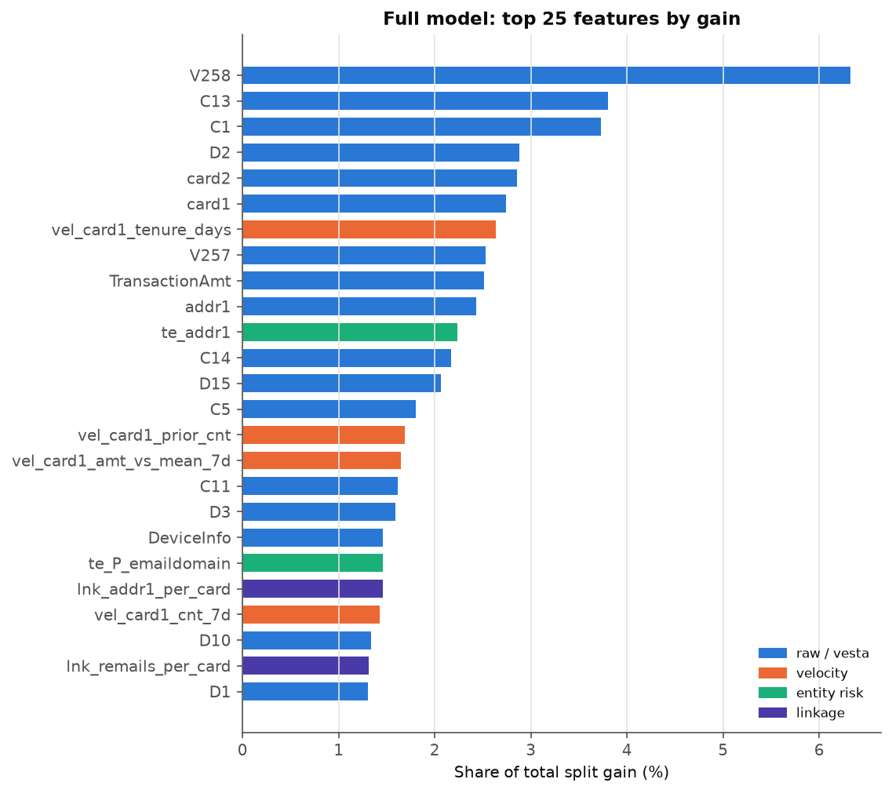
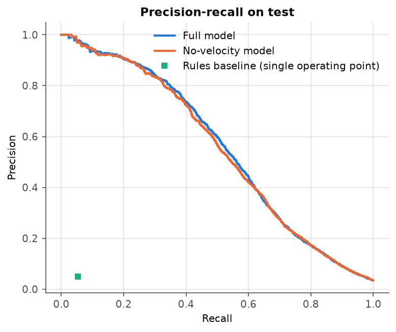
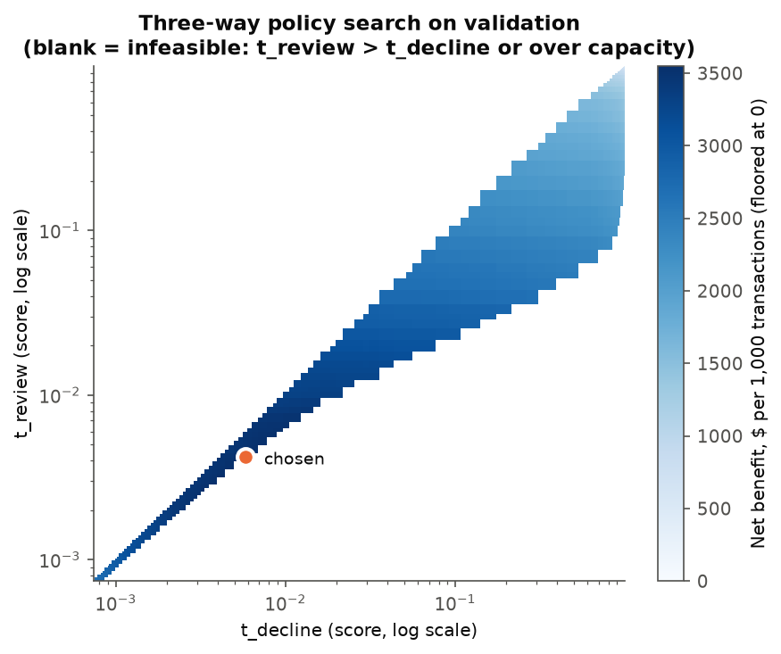
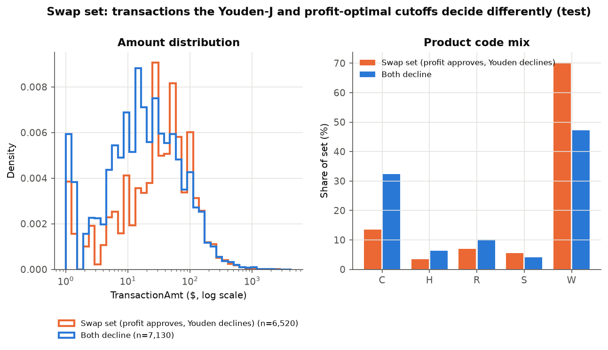
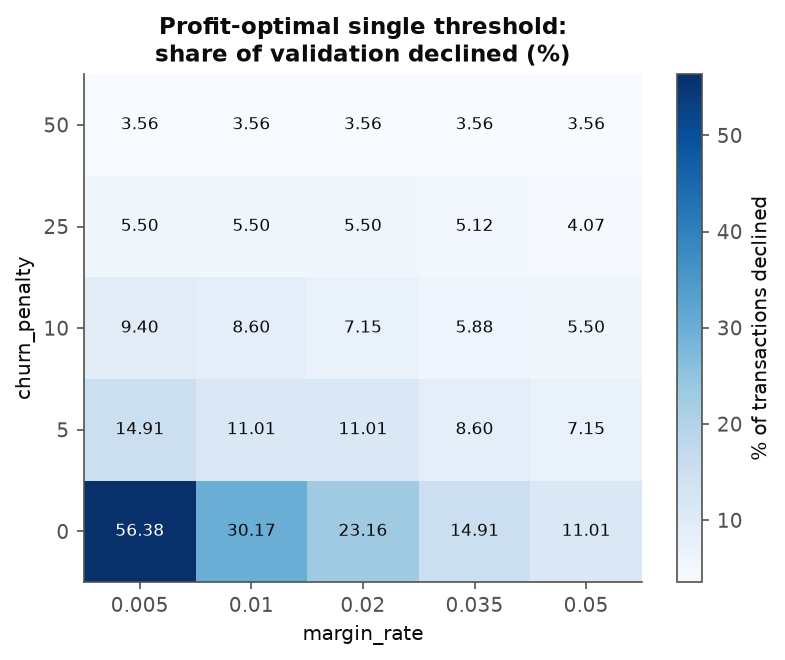
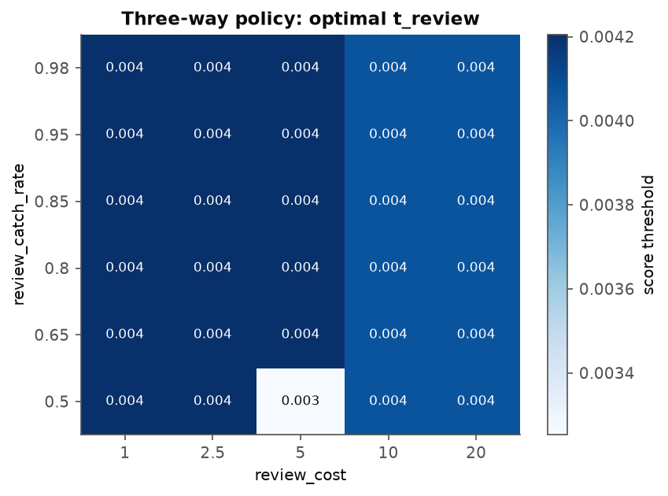
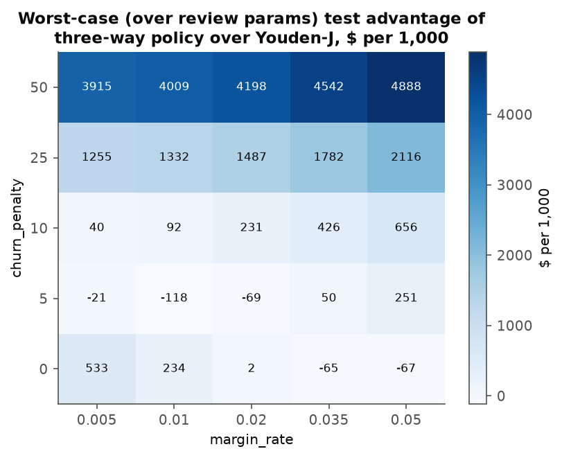
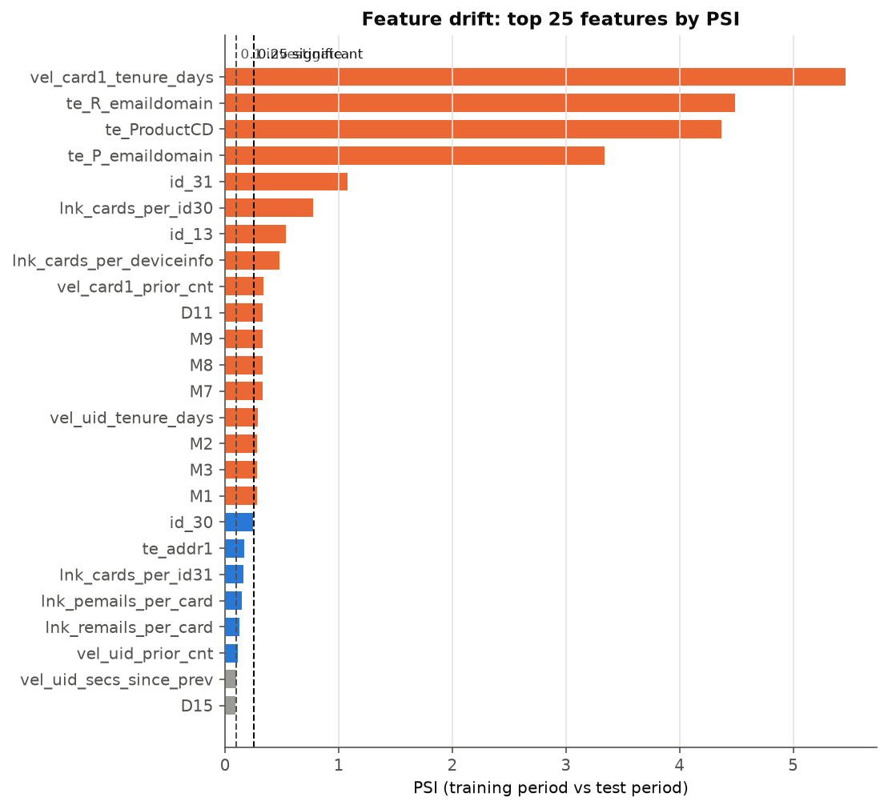
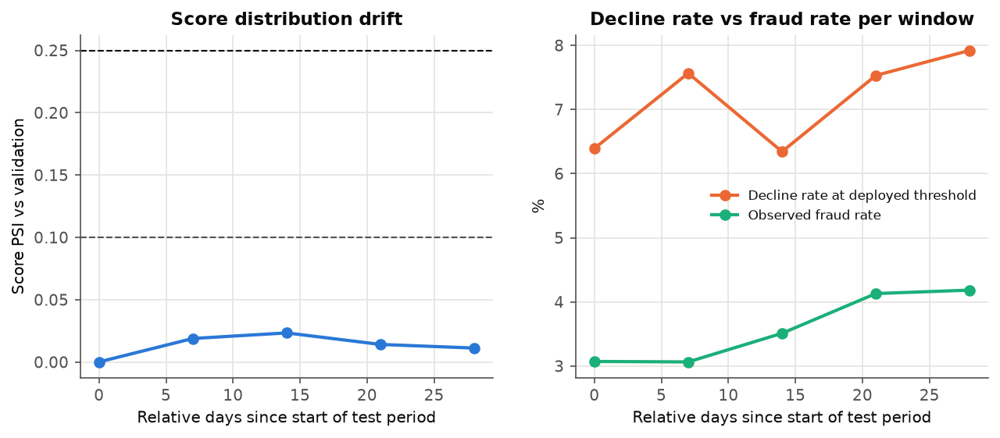

# Model and decision-policy report

Generated from `outputs/results.json` by `src/reporting/render.py`. Pre-registered
plan: `PRE_REGISTRATION.md`. Deviations and limitations: `FINDINGS.md`.

## Purpose and scope

Assess (a) a LightGBM classifier that scores card-not-present transactions for
fraud risk and (b) the decision policy that turns the score into approve, review
or decline. The decision policy is the object under review; the classifier is an
input to it. Out of scope: real-time serving, adversarial adaptation by
fraudsters, and any claim about a specific institution's economics.

## Data

- Source: IEEE-CIS Fraud Detection (Vesta), labelled files only.
  590,540 transactions after joining identity to transactions;
  20,663 labelled fraud (3.50%);
  24.4% of transactions have an identity record.
- Time: `TransactionDT` spans 182.0 relative days. It is
  an offset from an unknown reference and is used only for ordering and
  durations. "Per day" figures are per relative day.
- Split (time-ordered, ties kept together):

| Split | Rows | Fraud rate | Relative days | Fraud $ |
|---|---:|---:|---:|---:|
| train | 413,378 | 3.52% | 119.8 | $2,117,329 |
| valid | 88,581 | 3.43% | 31.4 | $496,908 |
| test | 88,581 | 3.48% | 30.8 | $469,609 |

Validation selects every threshold; test is used once for reporting.

## Features

148 features (cap 150):
82 raw provider columns,
35 pruned Vesta V-columns,
20 velocity,
4 entity-risk (target-encoded) and
7 linkage features. 323 columns were
dropped, each with a recorded reason (`outputs/tables/dropped_columns.csv`).

- **Velocity**: per `card1` and per composite account key `uid`
  (DECISIONS.md D0.4), counts and amount sums over the prior hour, day and week,
  seconds since the previous transaction, prior transaction count, tenure, and
  amount relative to the prior-week mean. Windows exclude the transaction itself,
  same-second peers and all later rows; tested on a hand-built fixture.
- **Entity risk**: smoothed target encoding (pseudo-count 50)
  of product code, billing region and purchaser / recipient email domain.
  Training rows are encoded out-of-fold over 5 contiguous
  time blocks; later rows use training statistics only; unseen categories receive
  the training prior.
- **Linkage**: distinct cards per device string, per OS, per browser and per
  device fingerprint; distinct purchaser emails, recipient emails and billing
  regions per card. Only strictly earlier transactions plus the current one count.
- High-cardinality strings use LightGBM native categorical handling with a
  training-period vocabulary; no one-hot encoding.

Share of model gain by family: raw 59.7%,
Vesta 11.6%,
velocity 16.4%,
entity risk 5.4%,
linkage 6.9%.
Gain share is an in-sample attribution, not evidence of causal value.

## Model

LightGBM binary classifier, learning rate 0.05, tuned by
grid search over 4 configurations with
5-fold expanding-window cross-validation inside the training
period. Chosen: 255 leaves, minimum
50 rows per leaf, feature fraction
0.5, 1,234 rounds
(mean early-stopping round across folds). Mean CV PR-AUC
0.6025 (standard deviation 0.0299).
The no-velocity model uses the same parameters, 128
features and 1,175 rounds (mean CV PR-AUC
0.6083). Both are trained on the training split
only (413,378 rows).

## Discrimination on test

| Metric | Full | No-velocity | Difference, paired bootstrap (1,000 resamples) |
|---|---:|---:|---|
| PR-AUC | 0.5524 | 0.5458 | 0.0066 (95% CI 0.0018 to 0.0115); interval excludes zero |
| ROC-AUC | 0.9028 | 0.9040 | -0.0011 (95% CI -0.0038 to 0.0015); interval includes zero: not distinguishable from no difference |
| Precision, top 1% | 88.0% | 87.5% | 0.6 pp (95% CI -0.8 to 1.9 pp); interval includes zero: not distinguishable from no difference |
| Recall, top 1% | 25.3% | 25.1% | 0.2 pp (95% CI -0.6 to 0.9 pp); interval includes zero: not distinguishable from no difference |
| Precision, top 5% | 42.3% | 41.9% | 0.4 pp (95% CI -0.5 to 1.2 pp); interval includes zero: not distinguishable from no difference |
| Recall, top 5% | 60.8% | 60.2% | 0.6 pp (95% CI -0.5 to 1.6 pp); interval includes zero: not distinguishable from no difference |

Precision and recall intervals hold the flagged set fixed (chosen on the full test
split) and resample rows; they do not include the variability from re-ranking
within each resample.

**Rules baseline.** Declines when the amount exceeds
$280.00 (training-period P90) and the account
key has no earlier transaction. It flags 3.69% of test
transactions with precision 5.0% and recall
5.3%. At the same volume the full model reaches precision
52.0%
(47.0 pp (95% CI 45.3 to 48.6 pp);
interval excludes zero) and recall
55.2%
(49.9 pp (95% CI 48.0 to 51.7 pp)). Its ROC-AUC
(0.5084) and PR-AUC
(0.0356) are computed on a binary flag and
are not comparable with a ranking model's.

## Decision layer

### Cost model

| Outcome | Cost | Default |
|---|---|---|
| Fraud approved | transaction amount | |
| Legitimate declined | margin rate x amount + churn penalty | 0.02 and $10 |
| Sent to review | review cost; a reviewed fraud is missed with probability one minus the catch rate | $5; catch rate 0.85 |

Review capacity: 34.5 cases per relative day,
1% of mean daily training-period volume.

### Policies on test (thresholds from validation)

| Policy | Net benefit per 1,000 | Total cost | Fraud loss left | False-decline cost | Review cost | Disruption rate | Legit sent to review | Capture (count) | Capture ($) | Reviews per day |
|---|---:|---:|---:|---:|---:|---:|---:|---:|---:|---:|---:|
| Approve everything | $0.00 | $469,609 | $469,609 | $0 | $0 | 0.00% | 0.00% | 0.0% | 0.0% | 0.0 |
| Rules baseline | $253.11 | $447,188 | $370,869 | $76,319 | $0 | 3.64% | 0.00% | 5.3% | 21.0% | 0.0 |
| Youden-J cutoff | $2,521.31 | $246,268 | $92,908 | $153,360 | $0 | 13.11% | 0.00% | 79.1% | 80.2% | 0.0 |
| Profit-optimal cutoff | $2,734.85 | $227,352 | $157,713 | $69,639 | $0 | 5.87% | 0.00% | 68.6% | 66.4% | 0.0 |
| Three-way, capacity-constrained | $2,811.82 | $220,535 | $157,183 | $57,947 | $5,880 | 4.88% | 1.26% | 68.8% | 66.6% | 38.2 |
| No-velocity model, three-way | $2,797.35 | $221,816 | $136,129 | $79,977 | $6,030 | 6.92% | 1.34% | 72.2% | 71.1% | 39.2 |

Selected thresholds (full model): Youden-J 0.0014;
profit-optimal 0.0045; three-way review from
0.0042, decline from 0.0058.

The three-way pair was chosen on validation subject to the capacity limit
(validation load 33.3 per day).
On test the policy produced a mean of 38.2
reviews per day, a busiest day of 56, and
20 of 31
relative days above capacity. A deployed queue would need either slack capacity or
a daily cap with overflow rules; this analysis does not model overflow.

### Comparisons (paired bootstrap, $ per 1,000 test transactions)

| Comparison | Difference | Reading |
|---|---|---|
| Profit-optimal minus Youden-J (H1) | $213.54 (95% CI $53.84 to $380.68) | interval excludes zero |
| Three-way minus rules (H2) | $2,558.71 (95% CI $2,264.48 to $2,833.10) | interval excludes zero |
| Three-way minus single profit-optimal | $76.96 (95% CI $54.27 to $104.84) | interval excludes zero |
| Full minus no-velocity, both three-way | $14.46 (95% CI -$137.72 to $160.43) | interval includes zero: not distinguishable from no difference |
| Three-way minus approve-all | $2,811.82 (95% CI $2,530.56 to $3,109.93) | interval excludes zero |
| Youden-J minus approve-all | $2,521.31 (95% CI $2,215.58 to $2,855.36) | interval excludes zero |
| Rules minus approve-all | $253.11 (95% CI $46.70 to $492.08) | interval excludes zero |

### AUC-optimal versus profit-optimal

Youden's J maximises true-positive rate minus false-positive rate, which is
optimal only if a missed fraud and a false decline carry equal weight per unit
rate. Here they do not. The profit-optimal cutoff is
0.0045 against Youden-J's 0.0014.
The Youden-J cutoff declines 1.9
times as many transactions. The difference in test net benefit is
$213.54 (95% CI $53.84 to $380.68) per
1,000 transactions, or
$18,916 across the test period.

On validation, where both were chosen: Youden-J net benefit
$3,222.74 and profit-optimal
$3,504.43 per
1,000. The test oracle threshold
(0.0039, chosen with test labels, not achievable)
would have given $2,754.60.

### Swap set

Transactions on which the two cutoffs disagree (test split).

| Set | Transactions | Fraud rate | Fraud | Amount total | Median amount | Amount P95 | Median tenure (days) | New account share |
|---|---:|---:|---:|---:|---:|---:|---:|---:|
| profit approves, Youden declines | 6,520 | 4.98% | 325 | $1,153,357 | $100.00 | $554.00 | 0.6 | 32.9% |
| profit declines, Youden approves | 0 | | | | | | | |
| both decline | 7,130 | 29.66% | 2,115 | $1,286,358 | $97.00 | $702.20 | 0.5 | 30.6% |
| both approve | 74,931 | 0.86% | 643 | $9,709,040 | $60.44 | $390.00 | 10.2 | 30.2% |

The decline sets of two cutoffs on one score are nested, so one direction is
empty by construction. Within the swap set, the profit-optimal policy's net
benefit is $0 and the Youden-J
policy's is -$18,916.
These are transactions only the Youden-J cutoff declines; declining them
costs more in false declines than the fraud it stops.
Product-code shares per set are in `outputs/tables/swap_set.csv`.

## Sensitivity to cost assumptions

The pre-registered grid has 750 cells (margin rate,
churn penalty, review cost, catch rate). At every cell the thresholds are
re-selected on validation and valued on test.

| Result | Value |
|---|---:|
| Three-way policy, test net benefit per 1,000: lowest cell | $1,649 |
| Three-way policy, test net benefit per 1,000: highest cell | $4,670 |
| Share of validation declined at the profit-optimal cutoff: lowest to highest | 3.56% to 56.38% |
| Cells where three-way at least matches the single profit cutoff | 74.9% |
| Cells where profit-optimal cutoff beats Youden-J | 80.0% |
| Cells where three-way beats rules | 100.0% |
| Cells where all three orderings hold (H4) | 60.7% |
| Cells where the three-way policy beats approve-all | 100.0% |

The absolute value of the policy moves by a wide margin with the assumptions; a
reader should treat any single dollar figure as conditional on them. The ranking
statement is the one this analysis supports, and even that does not hold in the pre-registered share of cells; see FINDINGS.md.

Review capacity (default costs):

| Capacity share of daily volume | Reviews per day allowed | Test net benefit per 1,000 | Test reviews per day | Disruption rate |
|---:|---:|---:|---:|---:|
| 0.5% | 17.3 | $2,781.97 | 17.1 | 5.70% |
| 1.0% | 34.5 | $2,811.82 | 38.2 | 4.88% |
| 2.0% | 69.0 | $2,877.46 | 75.8 | 4.51% |

## Stability

17 of 148 features have PSI at or above
0.25 between the training and test periods, and
6 are between 0.10 and 0.25.
The largest is 5.46. Score PSI between validation and test is
0.009; across 7-day
windows of the test period the largest window PSI is 0.023
and window PR-AUC ranges from 0.512 to
0.594. Details: `outputs/tables/psi_train_vs_test.csv`,
`outputs/tables/score_stability_test.csv`, FINDINGS.md and MONITORING_PLAN.md.

## Pre-registered hypotheses

| Hypothesis | Result |
|---|---|
| H1: profit-optimal cutoff beats Youden-J on test net benefit, interval excluding zero | PASS |
| H2: three-way policy beats rules baseline on test net benefit, interval excluding zero | PASS |
| H3: full model PR-AUC exceeds no-velocity model, interval excluding zero | PASS |
| H4: orderings hold in at least 80% of sensitivity cells | FAIL |
| Project success (H1 and H2) | PASS |

Environment: Python 3.12, LightGBM `4.7.0`,
seed 20,240,917.
